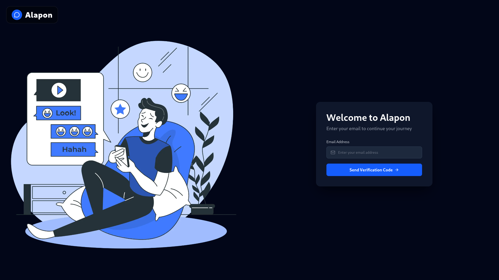
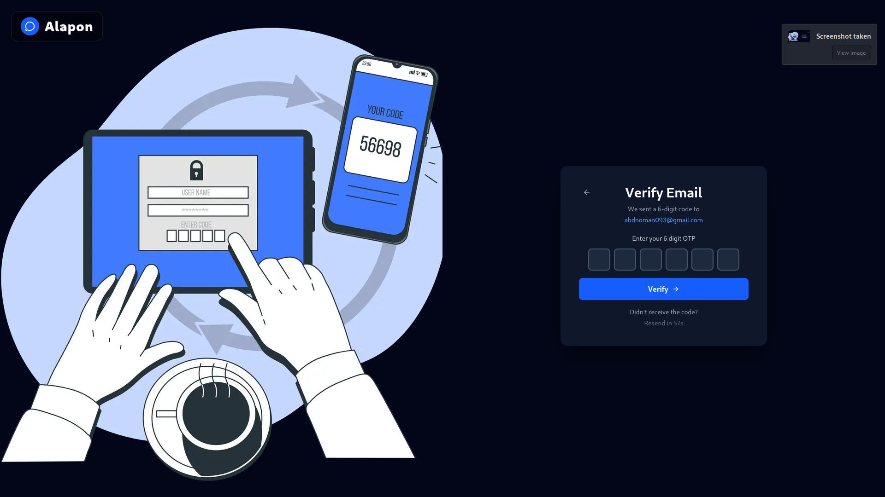
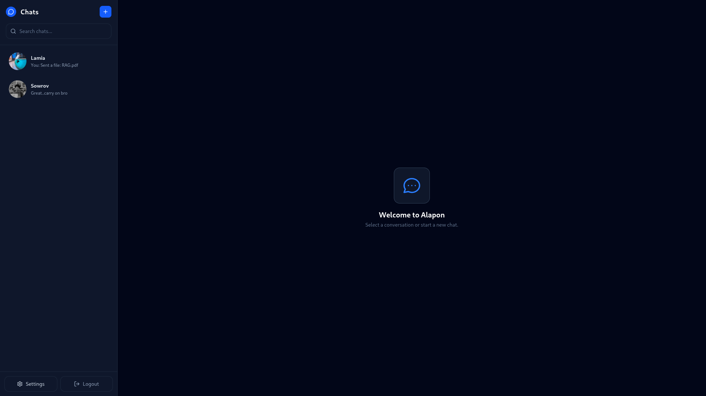
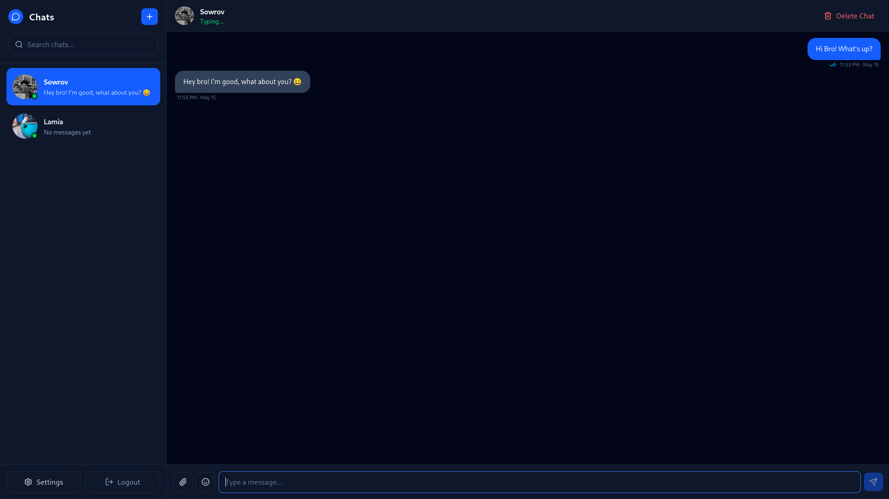
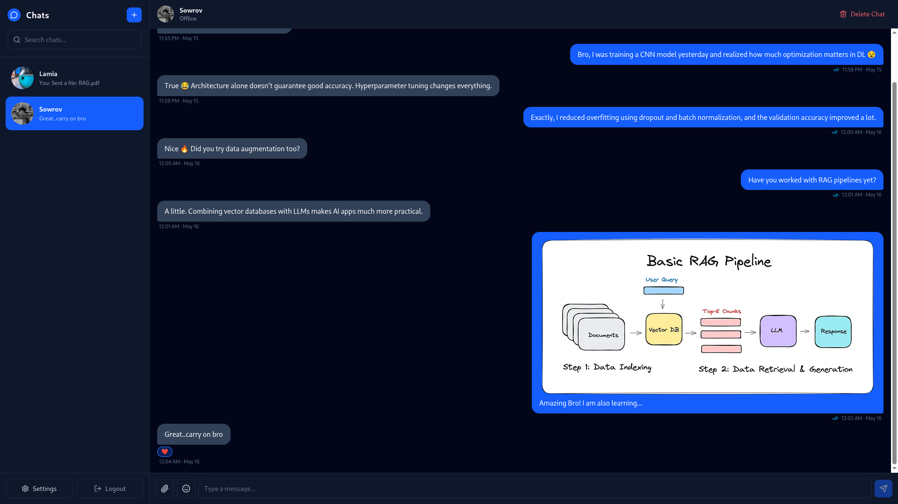
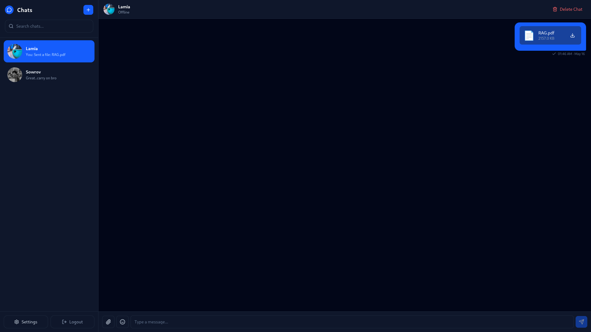
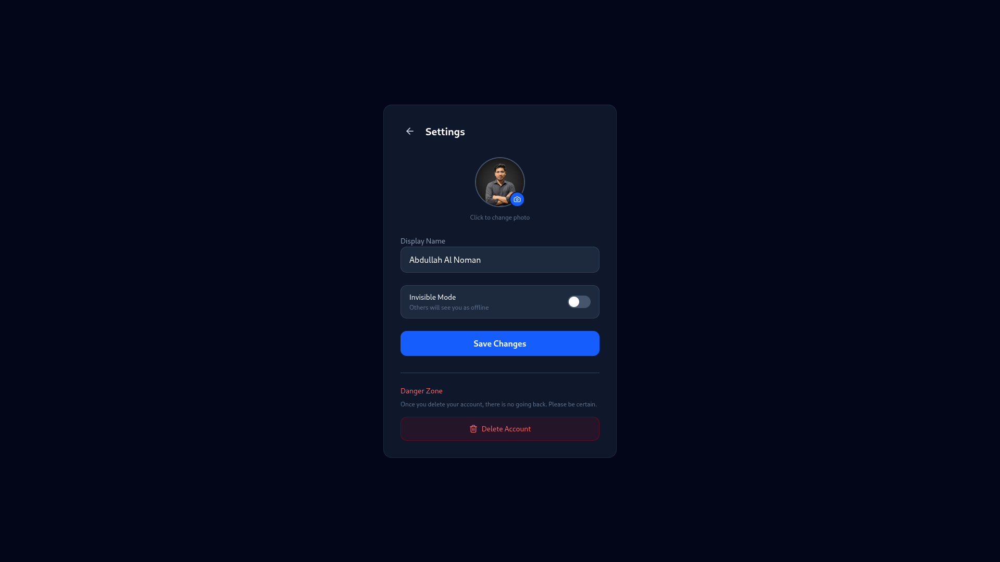

<div align="center">

# 💬 Alapon

### Real-Time Chat Application — Microservices Architecture

<br/>

[](https://alapon.abdnoman.com)
[](https://youtu.be/3cJgWUuWS9Q)

</div>

---

## 📖 Project Overview

A real-time chat application built with **microservices architecture**, featuring **JWT authentication**, **Socket.IO** messaging, file uploads via **Cloudinary**, and asynchronous email notifications using **RabbitMQ**. Deployed on a self-hosted **VPS** using **Dokploy** with **Docker** containerization and **Nginx** reverse proxy.

---

## ✨ Key Features

<table width="100%" align="center">
  <tr>
    <th width="30%" align="left">Feature</th>
    <th align="left">Description</th>
  </tr>
  <tr>
    <td><b>Real-time Messaging</b></td>
    <td>Socket.IO-powered instant messaging with typing indicators</td>
  </tr>
  <tr>
    <td><b>JWT Authentication</b></td>
    <td>Secure login with Redis session management</td>
  </tr>
  <tr>
    <td><b>Email Verification</b></td>
    <td>OTP-based login via RabbitMQ message queue</td>
  </tr>
  <tr>
    <td><b>File Uploads</b></td>
    <td>Images & documents with Cloudinary storage</td>
  </tr>
  <tr>
    <td><b>Message Reactions</b></td>
    <td>Emoji reactions on messages</td>
  </tr>
  <tr>
    <td><b>Message Editing</b></td>
    <td>Edit and delete messages in real-time</td>
  </tr>
  <tr>
    <td><b>User Management</b></td>
    <td>Profile updates, avatar upload, account deletion</td>
  </tr>
  <tr>
    <td><b>Online Status</b></td>
    <td>Real-time user presence with invisible mode</td>
  </tr>
  <tr>
    <td><b>Modern UI</b></td>
    <td>Tailwind CSS responsive design with dark theme</td>
  </tr>
  <tr>
    <td><b>Docker Containerization</b></td>
    <td>Multi-stage builds, non-root containers, health checks</td>
  </tr>
</table>

---

## 🏗️ System Architecture

<p align="center">
  
</p>

---

## 🛠️ Tech Stack


### Frontend

<table width="100%" align="center">
  <tr>
    <td align="center" width="33%"></td>
    <td align="center" width="33%"></td>
    <td align="center" width="33%"></td>
  </tr>
  <tr>
    <td align="center" width="33%"></td>
    <td align="center" width="33%"></td>
    <td align="center" width="33%"></td>
  </tr>
</table>

### Backend Services

<table width="100%" align="center">
  <tr>
    <th align="center">👤 User Service</th>
    <th align="center">💬 Chat Service</th>
    <th align="center">📧 Mail Service</th>
  </tr>
  <tr>
    <td align="center">
      <br/><br/>
      <br/><br/>
      <br/><br/>
      <br/><br/>
      <br/><br/>
      
    </td>
    <td align="center">
      <br/><br/>
      <br/><br/>
      <br/><br/>
      <br/><br/>
      
    </td>
    <td align="center">
      <br/><br/>
      <br/><br/>
      
    </td>
  </tr>
</table>

### Infrastructure & DevOps

<table width="100%" align="center">
  <tr>
    <th colspan="4" align="center">Infrastructure & DevOps</th>
  </tr>
  <tr>
    <td align="center" width="25%">
      <br/><sub>Docker</sub>
    </td>
    <td align="center" width="25%">
      <br/><sub>Deployment</sub>
    </td>
    <td align="center" width="25%">
      <br/><sub>Reverse Proxy</sub>
    </td>
    <td align="center" width="25%">
      <br/><sub>DNS & SSL</sub>
    </td>
  </tr>
  <tr>
    <td align="center" width="25%">
      <br/><sub>Database</sub>
    </td>
    <td align="center" width="25%">
      <br/><sub>Cache</sub>
    </td>
    <td align="center" width="25%">
      <br/><sub>File Storage</sub>
    </td>
    <td align="center" width="25%">
      <br/><sub>Message Queue</sub>
    </td>
  </tr>
</table>

---

## 📸 Screenshots

<table width="100%" align="center">
  <tr>
    <td align="center" width="50%">
      
      <br /><b>Login Page</b>
    </td>
    <td align="center" width="50%">
      
      <br /><b>Verification Page</b>
    </td>
  </tr>
  <tr>
    <td align="center" width="50%">
      
      <br /><b>Chat Interface</b>
    </td>
    <td align="center" width="50%">
      
      <br /><b>Typing Indicator</b>
    </td>
  </tr>
  <tr>
    <td align="center" width="50%">
      
      <br /><b>Inbox / Chat List</b>
    </td>
    <td align="center" width="50%">
      
      <br /><b>File Upload</b>
    </td>
  </tr>
  <tr>
    <td align="center" colspan="2">
      
      <br /><b>User Profile</b>
    </td>
  </tr>
</table>

---

## 📡 API Endpoints

<p align="center"><b>👤 User Service — Port 5000</b></p>

<table width="80%" align="center">
  <tr>
    <th align="center">Method</th>
    <th align="left">Endpoint</th>
    <th align="left">Description</th>
    <th align="center">Auth</th>
  </tr>
  <tr>
    <td align="center"><code>POST</code></td>
    <td><code>/api/v1/login</code></td>
    <td>OTP login (sends email)</td>
    <td align="center">No</td>
  </tr>
  <tr>
    <td align="center"><code>POST</code></td>
    <td><code>/api/v1/verify</code></td>
    <td>Verify OTP</td>
    <td align="center">No</td>
  </tr>
  <tr>
    <td align="center"><code>GET</code></td>
    <td><code>/api/v1/me</code></td>
    <td>Get current user profile</td>
    <td align="center">Yes</td>
  </tr>
  <tr>
    <td align="center"><code>GET</code></td>
    <td><code>/api/v1/user/all</code></td>
    <td>Get all users</td>
    <td align="center">Yes</td>
  </tr>
  <tr>
    <td align="center"><code>GET</code></td>
    <td><code>/api/v1/user/:id</code></td>
    <td>Get specific user</td>
    <td align="center">No</td>
  </tr>
  <tr>
    <td align="center"><code>PUT</code></td>
    <td><code>/api/v1/user/update</code></td>
    <td>Update profile + avatar</td>
    <td align="center">Yes</td>
  </tr>
  <tr>
    <td align="center"><code>DELETE</code></td>
    <td><code>/api/v1/user/delete</code></td>
    <td>Delete account</td>
    <td align="center">Yes</td>
  </tr>
  <tr>
    <td align="center"><code>GET</code></td>
    <td><code>/health</code></td>
    <td>Health check</td>
    <td align="center">No</td>
  </tr>
</table>

<br/>

<p align="center"><b>💬 Chat Service — Port 5002</b></p>

<table width="80%" align="center">
  <tr>
    <th align="center">Method</th>
    <th align="left">Endpoint</th>
    <th align="left">Description</th>
    <th align="center">Auth</th>
  </tr>
  <tr>
    <td align="center"><code>POST</code></td>
    <td><code>/api/v1/chat/new</code></td>
    <td>Create new chat</td>
    <td align="center">Yes</td>
  </tr>
  <tr>
    <td align="center"><code>GET</code></td>
    <td><code>/api/v1/chats/all</code></td>
    <td>Get all user chats</td>
    <td align="center">Yes</td>
  </tr>
  <tr>
    <td align="center"><code>POST</code></td>
    <td><code>/api/v1/message</code></td>
    <td>Send message (with file)</td>
    <td align="center">Yes</td>
  </tr>
  <tr>
    <td align="center"><code>GET</code></td>
    <td><code>/api/v1/message/:chatId</code></td>
    <td>Get messages + mark seen</td>
    <td align="center">Yes</td>
  </tr>
  <tr>
    <td align="center"><code>PATCH</code></td>
    <td><code>/api/v1/message/:messageId</code></td>
    <td>Edit message</td>
    <td align="center">Yes</td>
  </tr>
  <tr>
    <td align="center"><code>PATCH</code></td>
    <td><code>/api/v1/message/:messageId/react</code></td>
    <td>React with emoji</td>
    <td align="center">Yes</td>
  </tr>
  <tr>
    <td align="center"><code>DELETE</code></td>
    <td><code>/api/v1/message/:messageId</code></td>
    <td>Delete message</td>
    <td align="center">Yes</td>
  </tr>
  <tr>
    <td align="center"><code>DELETE</code></td>
    <td><code>/api/v1/chat/:chatId</code></td>
    <td>Delete entire chat</td>
    <td align="center">Yes</td>
  </tr>
  <tr>
    <td align="center"><code>GET</code></td>
    <td><code>/health</code></td>
    <td>Health check</td>
    <td align="center">No</td>
  </tr>
</table>

<br/>

<p align="center"><b>📧 Mail Service — Port 5003</b></p>

> <p align="center">Works as a <b>RabbitMQ consumer</b> — listens on <code>send-otp</code> queue and sends emails via Nodemailer (Gmail SMTP).</p>

<table width="80%" align="center">
  <tr>
    <th align="center">Method</th>
    <th align="left">Endpoint</th>
    <th align="left">Description</th>
  </tr>
  <tr>
    <td align="center"><code>GET</code></td>
    <td><code>/health</code></td>
    <td>Health check</td>
  </tr>
</table>

---

## 🚀 Installation & Local Setup

### Prerequisites

- **Node.js** 20+
- **Docker** & **Docker Compose**
- **Git**

### Steps

```bash
# 1. Clone the repository
git clone https://github.com/nomancsediu/web-development-bootcamp-may-2026.git
cd web-development-bootcamp-may-2026/nomancsediu/chat-app

# 2. Setup environment
cp .env.example .env
# Edit .env with your credentials

# 3. Start all services
docker-compose up -d

# 4. Access the application
# Frontend:  http://localhost:3000
# User API:  http://localhost:5000
# Chat API:  http://localhost:5002
# Mail API:  http://localhost:5003
# RabbitMQ:  http://localhost:15672
```

---

## 🌍 Production Deployment

### Architecture Overview

<table width="80%" align="center">
  <tr>
    <th align="center">Component</th>
    <th align="center">Service</th>
    <th align="center">Type</th>
  </tr>
  <tr>
    <td align="center">Database</td>
    <td align="center">MongoDB Atlas</td>
    <td align="center">External Managed</td>
  </tr>
  <tr>
    <td align="center">Cache</td>
    <td align="center">Upstash Redis</td>
    <td align="center">External Managed</td>
  </tr>
  <tr>
    <td align="center">Message Queue</td>
    <td align="center">RabbitMQ 3.12</td>
    <td align="center">Self-Hosted (VPS)</td>
  </tr>
  <tr>
    <td align="center">File Storage</td>
    <td align="center">Cloudinary</td>
    <td align="center">External Managed</td>
  </tr>
  <tr>
    <td align="center">Email</td>
    <td align="center">Gmail SMTP</td>
    <td align="center">External</td>
  </tr>
  <tr>
    <td align="center">Reverse Proxy</td>
    <td align="center">Nginx</td>
    <td align="center">Self-Hosted (VPS)</td>
  </tr>
  <tr>
    <td align="center">Deployment</td>
    <td align="center">Dokploy</td>
    <td align="center">Self-Hosted (VPS)</td>
  </tr>
  <tr>
    <td align="center">DNS & SSL</td>
    <td align="center">Cloudflare</td>
    <td align="center">External</td>
  </tr>
</table>

### Deploy Steps

```bash
# 1. Deploy using production compose
docker-compose -f docker-compose.prod.yml up -d --build

# 2. Configure environment variables in Dokploy dashboard

# 3. Setup Nginx reverse proxy with SSL (Certbot)
```

### Environment Variables

```env
MONGO_URI=mongodb+srv://...
REDIS_URL=rediss://...
RABBITMQ_URL=amqp://...
RABBITMQ_HOST=localhost
RABBITMQ_USERNAME=guest
RABBITMQ_PASSWORD=guest
CLOUDINARY_CLOUD_NAME=...
CLOUDINARY_API_KEY=...
CLOUDINARY_API_SECRET=...
JWT_SECRET=...
MAIL_USER=...
MAIL_PASSWORD=...
USER_SERVICE=http://user:5000
NEXT_PUBLIC_USER_SERVICE=https://user.abdnoman.com
NEXT_PUBLIC_CHAT_SERVICE=https://chat.abdnoman.com
```

---

## 📁 Project Structure

```
chat-app/
├── backend/
│   ├── user/                    # Authentication & user management
│   │   ├── src/
│   │   │   ├── config/          # DB, Redis, RabbitMQ, Cloudinary
│   │   │   ├── controllers/     # User CRUD + OTP logic
│   │   │   ├── middleware/      # Auth, Multer (avatar upload)
│   │   │   ├── model/           # Mongoose User model
│   │   │   └── routes/          # User API routes
│   │   ├── Dockerfile
│   │   └── package.json
│   ├── chat/                    # Real-time messaging
│   │   ├── src/
│   │   │   ├── config/          # DB, Socket.IO, Cloudinary
│   │   │   ├── controllers/     # Chat & message logic
│   │   │   ├── middleware/      # Auth, Multer (file upload)
│   │   │   ├── models/          # Chat & Message models
│   │   │   └── routes/          # Chat API routes
│   │   ├── Dockerfile
│   │   └── package.json
│   └── mail/                    # Email notifications
│       ├── src/
│       │   ├── consumer.ts      # RabbitMQ consumer
│       │   └── index.ts         # Express + health check
│       ├── Dockerfile
│       └── package.json
├── frontend/                    # Next.js application
│   ├── app/                     # App router pages
│   ├── components/              # React components
│   ├── context/                 # App & Socket context
│   ├── Dockerfile
│   └── package.json
├── readme-photos/               # README screenshots
├── docker-compose.yml           # Local development
├── docker-compose.prod.yml      # Production deployment
├── nginx.conf                   # Reverse proxy config
└── .env.example                 # Environment template
```

---

## 🔒 Security Features

- **JWT authentication** with 15-day token expiration
- **OTP-based login** — no password stored on server
- **Redis session** management with 5-minute OTP expiry
- **CORS protection** on all services with origin whitelisting
- **Non-root Docker containers** — runs as `nodejs` user
- **Environment variable** encryption via Dokploy
- **Rate limiting** on OTP requests (1 per 60 seconds)
- **Input validation** on all API endpoints
- **File type filtering** — only allowed MIME types accepted
- **File size limits** — 5MB for avatars, 10MB for chat files

---

## 🤝 Contributing

1. **Fork** the repository
2. Create a **feature branch** (`git checkout -b feature/amazing-feature`)
3. **Commit** your changes (`git commit -m 'Add amazing feature'`)
4. **Push** to the branch (`git push origin feature/amazing-feature`)
5. Open a **Pull Request**

---

## 📄 License

This project is licensed under the **MIT License** — feel free to use it for learning and portfolio purposes.

---

<div align="center">

<br/>

## 👨‍💻 Abdullah Al Noman

<br/>

[](mailto:abdnoman093@gmail.com)
[](https://linkedin.com/in/nomanit)

[](https://abdnoman.com)
[](https://github.com/nomancsediu)

<br/>

⭐ **Star this repo if you find it helpful!** ⭐

</div>
